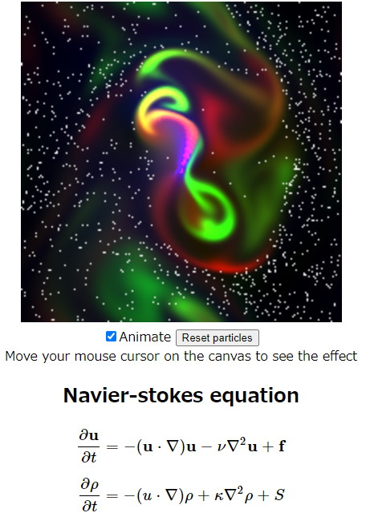

# ray-rust-wasm

Webassembly port of [ray-rust](https://github.com/msakuta/ray-rust) project.

Try it now with your browser!

https://msakuta.github.io/ray-rust-wasm/

## How to build and run

Install

* Cargo >1.40
* npm

Install wasm-pack command line tool with

    cargo install wasm-pack

Build the project

    wasm-pack build --target web

Serve the web server

    npx serve .

Browse http://localhost:5000/

## Controls

You can use WASDQZ keys to move around the world and arrow keys to rotate the camera.

Also, you can click on the Animate checkbox to enable animation with predefined path.

## Screenshots

## The tutorial that I used

https://aralroca.com/blog/first-steps-webassembly-rust
